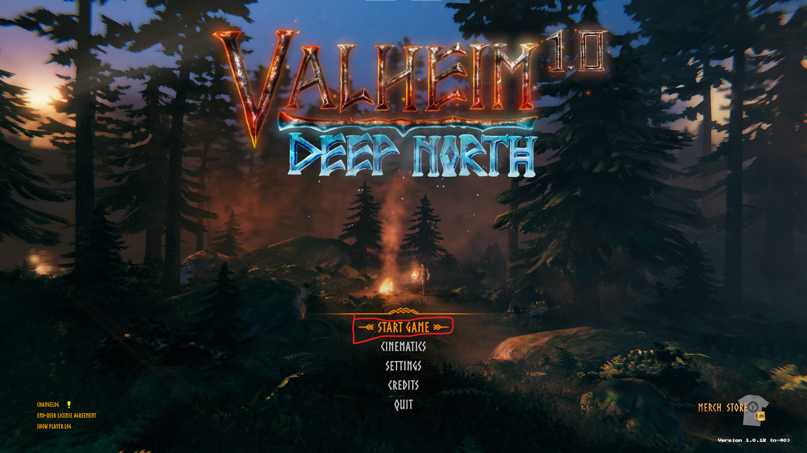
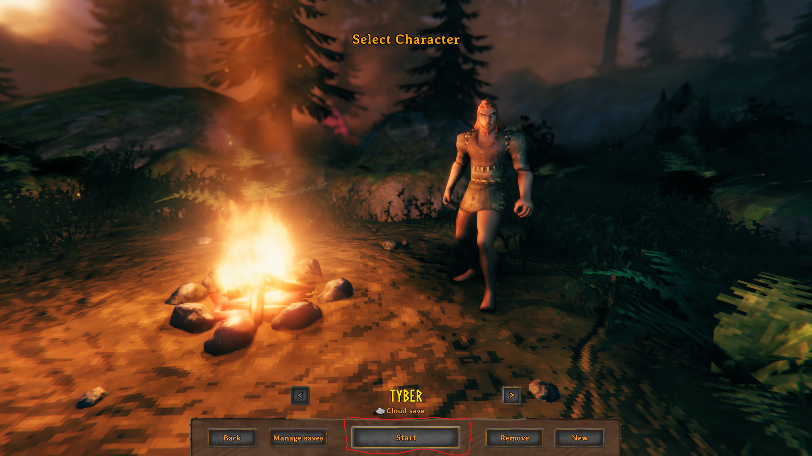
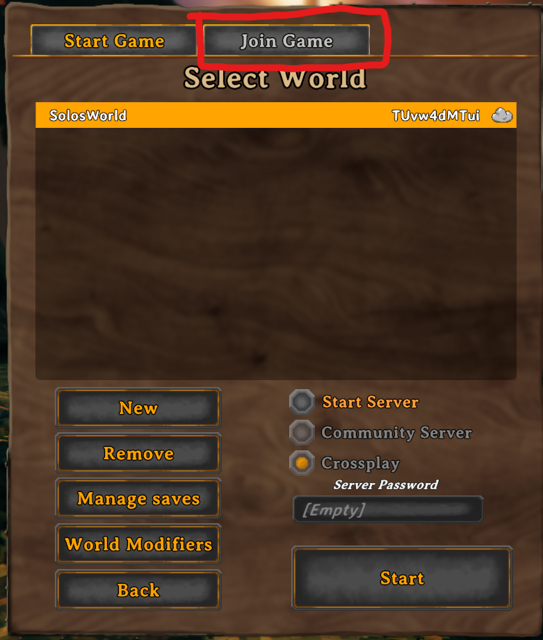
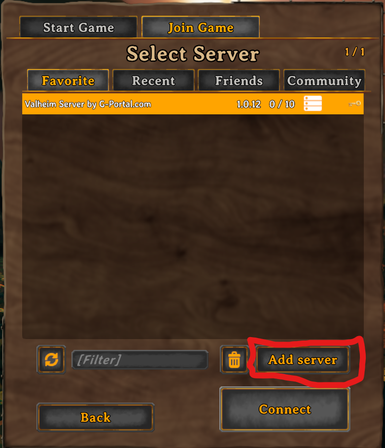
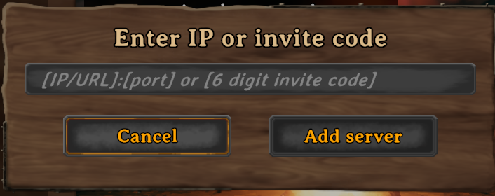
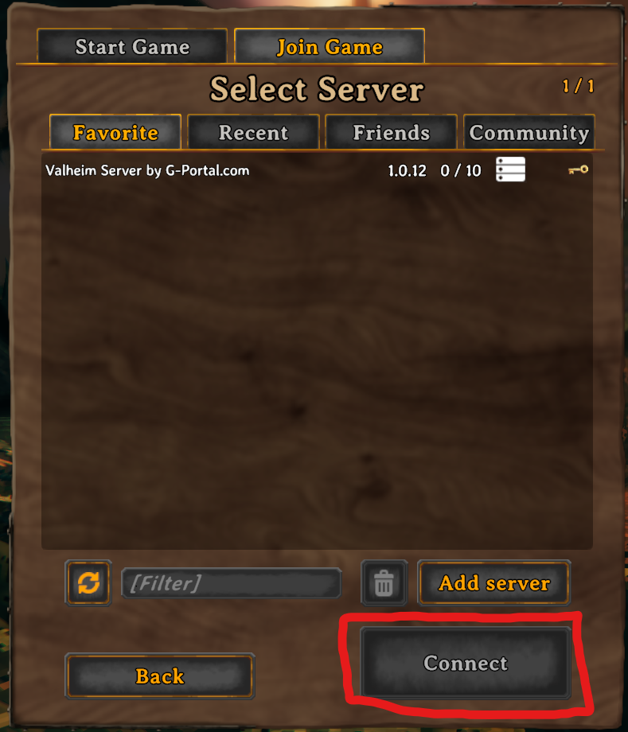
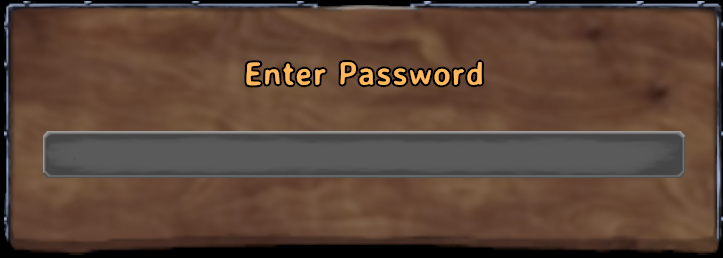

# How to Log into the Valheim server
#### Outline
1. [Log in via the game client for first time](#via-the-game-client)
1. [Credentials](#credentials)

## First time Via the game client

- Launch the game client
  - This will launch the game and show several videos before taking you to the main menu

- At the main menu, click on `Start Game`

  - This will take you to the character selection screen

- At the character selection screen, select your desired character and hit `Start`
  - This will open the start game window.

  - If you need to create a character, click `New` and create the new character. You will be returned to this screen after completion. At that point, complete this step by clicking `Start`

- Click the tab `Join Game` to switch to the server selection page

- Click on the `Add server` button to bring up the IP entry field

- Enter `212.56.33.120:29500` into the text field, then click `Add Server`. This will close the IP entry field, and now you should see a new server in the server list.

- Click on the server in the server list so that it is highlighted, then click `Connect`. This will connect you to the server and you should see a loading screen or a connecting screen. Next you will be prompted for a password.
  - If no server is selected, you will not get any response from clicking. In that case, try clicking on the desired server again, so that it is highlighted in yellow.
  - If there is a red X to the right of the server name, then there is an issue connecting to the server.
    - The server could be down.
    - The information entered could be incorrect or out of date.

- When prompted for a password, enter `beesballs`. You should now be in the server.

## Credentials
**ip:port** `212.56.33.120:29500`

**password** `beesballs`